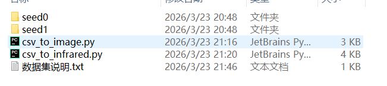
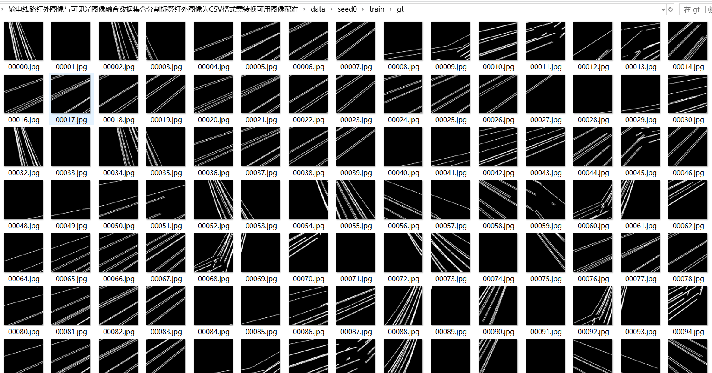
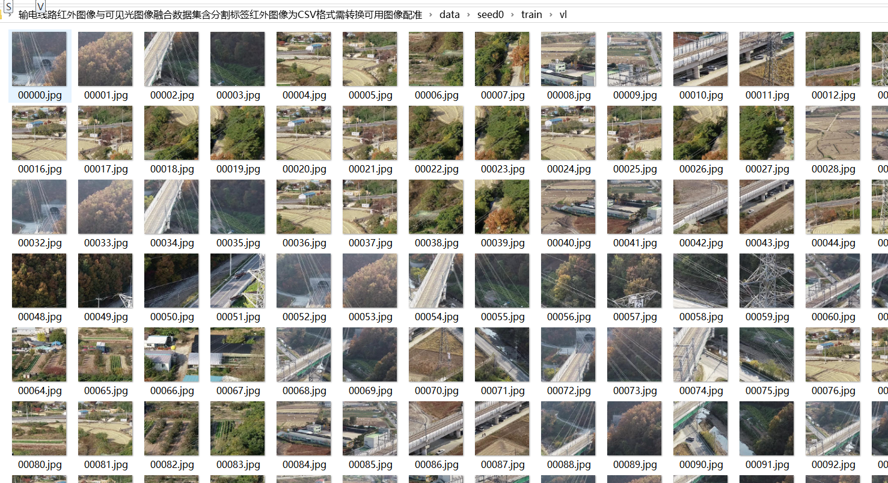

# Transmission Line The road Infrared Image and Visible Light Image Blend Dataset containing Segmentation Labels Infrared Image are CSVformat Conversion Required Available Image Registration

Transmission line infrared image and visible image fusion dataset with segmentation label infrared image for CSV format need to convert available image registration

【Note】:

csv_to_image.py converts CSV format to images

csv_to_infrared.py is a Python script that converts CSV files into RGB images and saves them in the ir/infrared folder. Note that these images are not infrared but rather reconstructed RGB images.

## Images

---

Here is a pay link on Stripe (https://buy.stripe.com/3cs8yP7sY87d0vu9AB). Please contact me lonlonago@foxmail.com after funding $89, and I will send you a complete data files, thank you!

